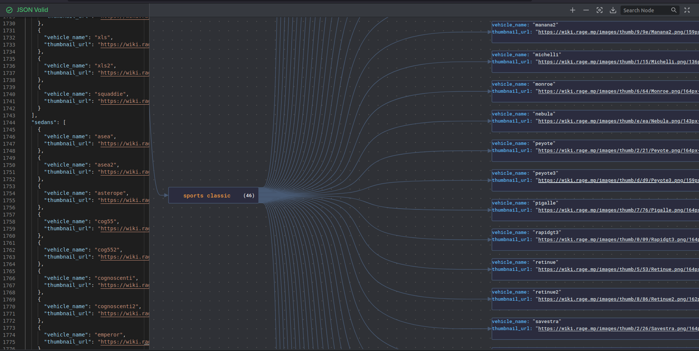
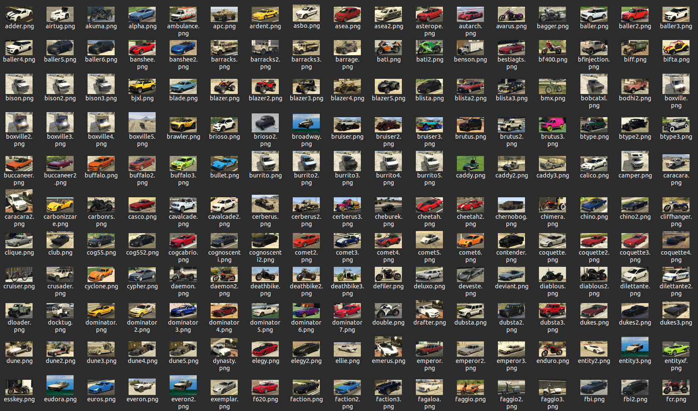

# GTA V vehicles scraper

<div align="center"></br>
  
  
  
  
  
</div></br>

The project is a web scraper that searches for information and images of **GTA V** vehicles, the script can be modified to search in other web sources.

## How to run

```bash
# To build the typescript project
npm run build

# To run the builded scraper
npm run start
```

## Filters

All filters must be defined in the **`/src/index.ts`** file, instructions below.

### Define the search sources

The first parameter in the **`scraper.start()`** method is the search source (**required**), you can choose and implement other options.

Sources:

-   [wiki-range](https://wiki.rage.mp/index.php?title=Vehicles)

</br>

```ts
const scraper = new Scraper();
await scraper.init();

const result = await scraper.start('wiki-rage');
```

</br>

### Define vehicle categories to be excluded from the search

The second parameter in the **`scraper.start()`** method is the vehicle categories to be excluded (**optional**), you must define a string array that contains all the categories that you want to exclude.

[Click here to view vehicle categories](docs/vehicleCategories.md)

```ts
const scraper = new Scraper();
await scraper.init();

const result = await scraper.start(
    'wiki-rage', 
    [
        'boats',
        'helicopters',
        'industrial',
        'planes',
        'service',
        'trailer',
        'trains'
    ]
);
```

<br/>

## Output folder

All scraped data will be created in

**`/build/result`** (**production**)
**`/src/result`** (**development**)

```bash
📁 result
    ╠ 📁 images
    ╚ 📄 result.json
```

### result.json

It's the file with all the vehicles data separated by category

[]()

```js
{
    "commercials": [
        {
            "vehicle_name": 'benson',
            "thumbnail_url": 'https://wiki.rage.mp/images/thumb/b/bd/Benson.png/164px-Benson.png',
        }
        // ... other vehicles objects
    ],
    "compacts": [...],
    "coupes": [...],
    "cycles": [...],
    "military": [...],
    // ... other categories
}
```


[Json crack editor](https://jsoncrack.com/editor)

### images

It's the folder where all images of the vehicle will be stored.


